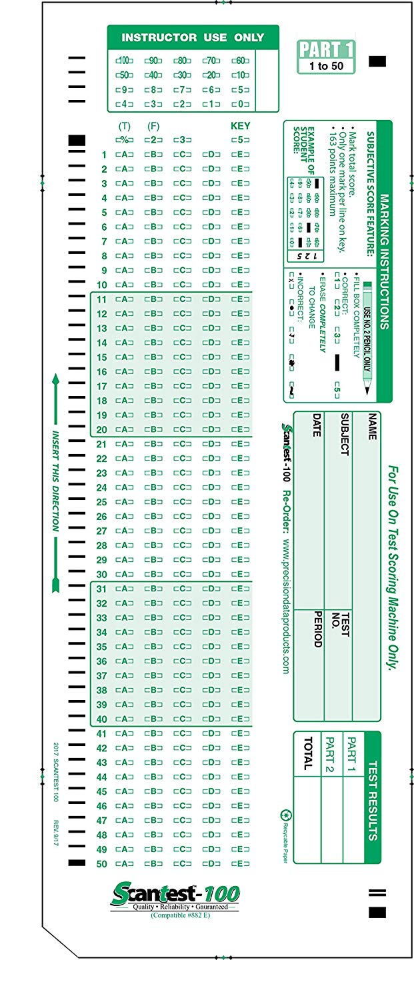

# Assignment 2
## Pre-requisites

* Install _Pipenv_

```
pip install pipenv
```
* Install Package that need to import

```
pip3 install opencv-python
pip3 install numpy
```

* Install _[Flask](https://palletsprojects.com/p/flask/)_

```
pipenv install flask==1.1.1
```

Once you have installed, you will see _Pipfile_ and _Pipfile.lock_ files under working directory.

* Install _pytest_ for development, not for production.

```
pipenv install pytest --dev
```

* Run this command to see the dependency graph

```
pipenv graph
```
* Run your Flask application from a shell/terminal.

```sh
pipenv shell
$ env FLASK_APP=app.py flask run
```

## Implementation

* For all uploaded test/scantron submissions data will be saved in DB.txt


* For all uploaded scantron binary data will be saved in "files" folder 


* Using POSTMAN to Post test. Remember to put json data into body raw part.(REMEMBER USE THE RIGHT LINK)


* Using POSTMAN to Post scantron. Remember to leave the key part empty and upload binary image file on the value part.(REMEMBER USE THE RIGHT LINK)


* Using POSTMAN to GET test.(REMEMBER USE THE RIGHT LINK)


In the assignment 2, you will be building a scantron OCR application in Python Flask. The application handles:

* Scantron submission
* Format validation
* Score calculation against answer keys
* Score reporting

All the above features will be handled via a set of REST APIs. The application will persist data into a local SQLite DB.

# APIs

## Create a test

_Request_

> POST http://localhost:5000/api/tests

```json
{
    "subject": "Math",
    "answer_keys": {
        "1": "A",
        "2": "B",
        "3": "C",
        "..": "..",
        "49": "D",
        "50": "E"
    }
}
```

_Response_

```json
201 Created

{
    "test_id": 1,
    "subject": "Math",
    "answer_keys": {
        "1": "A",
        "2": "B",
        "3": "C",
        "..": "..",
        "49": "D",
        "50": "E"
    },
    "submissions": [] 
}
```


## Upload a scantron

_Request_

> POST http://localhost:5000/api/tests/1/scantrons


```
# HTTP Request Body
BINARY_SCANTRON_PDF_FILE_DATA
```

_Response_

```json
201 Created

{
    "scantron_id": 1,
    "scantron_url": "http://localhost:5000/files/1.pdf",
    "name": "Foo Bar",
    "subject": "Math",
    "score": 40,
    "result": {
        "1": {
            "actual": "A",
            "expected": "B"
        },
        "..": {
            "actual": "..",
            "expected": ".."
        },
        "50": {
            "actual": "E",
            "expected": "E"
        }
    }
}
```

## Check all scantron submissions

_Request_

> GET http://localhost:5000/api/tests/1


_Response_

```json
{
    "test_id": 1,
    "subject": "Math",
    "answer_keys": {
        "1": "A",
        "2": "B",
        "3": "C",
        "..": "..",
        "49": "D",
        "50": "E"
    },
    "submissions": [
        {
            "scantron_id": 1,
            "scantron_url": "http://localhost:5000/files/1.pdf",
            "name": "Foo Bar",
            "subject": "Math",
            "score": 40,
            "result": {
                "1": {
                    "actual": "A",
                    "expected": "B"
                },
                "..": {
                    "actual": "..",
                    "expected": ".."
                },
                "50": {
                    "actual": "E",
                    "expected": "E"
                }
            }
        }
    ] 
}
```





